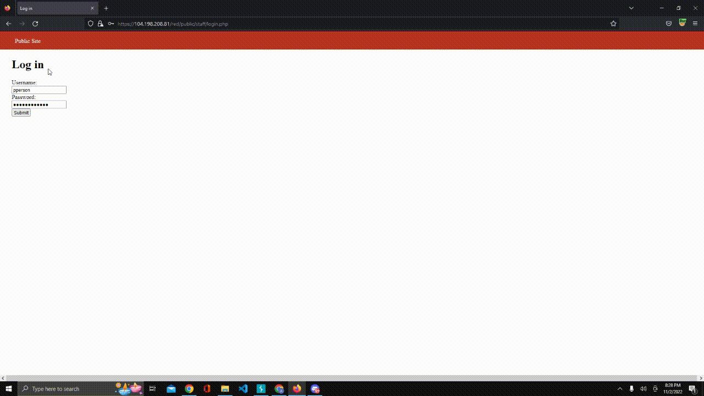

# Pen Testing Live Targets

Time spent: 8 hours spent in total

> Objective: Identify vulnerabilities in three different versions of the Globitek website: blue, green, and red.

The six possible exploits are:

* Username Enumeration
* Insecure Direct Object Reference (IDOR)
* SQL Injection (SQLi)
* Cross-Site Scripting (XSS)
* Cross-Site Request Forgery (CSRF)
* Session Hijacking/Fixation

Each color is vulnerable to only 2 of the 6 possible exploits. First discover which color has the specific vulnerability, then write a short description of how to exploit it, and finally demonstrate it using screenshots compiled into a GIF.

## Blue

Vulnerability #1: Session Hijacking

Description:

In the screenshot above, I first logged into pperson account with password and then changed the session ID by looking up the index page. Here I copied the PHPSESSION ID on the screen on the left and then created another incognito page. I repeated the steps I took to find the PHPSESSION ID and then found that the ID was different from the original, so therefore I pasted the original PHPSESSIONID and set it as the new one for the incognito version. From here, we can see that it was successful by seeing that it has been updated to the original PHPSESSIONID on the Index of /blue page. 

Vulnerability #2: SQLi Injection

Description:

For this vulnerability, I utilized basic SQL injections by typing in ‘ while looking up the Salesperson profiles on the site. In the screenshot above, I used Daron Burke’s profile url and then added a ‘ after id=1, which resulted in a message that says “Database Inquiry Failed”. At this point, I tried to input the OR injection as a part of the code. From here, I typed ‘ OR 1=1 –’
after id=1 as the new injection.

## Green

Vulnerability #1: Username Enumeration

Description:

I experimented with this vulnerability by attempting to log into the pperson account with an incorrect password and then compared the results by logging into another account with a user called “random”. Here I compared the two post request responses for both by sending them to the comparer. In the last part, we can see the differences: the pperson response contained the word “failure” while the random account log in response contained the word “failed” instead.

Vulnerability #2: Cross-site Scripting

Description:

After logging into the pperson account, I revealed a reflected XSS attack by clicking on the Feedback page. From here, I entered my first and last name into the boxes for “Contack Us” and then clicked submit the feedback. After logging out and then back in, I clicked the Feedback button again and found a pop up message that reads “Sean found the XSS”, which was an attack done previously by another student.

## Red

Vulnerability #1: Cross Site Request Forgery

Description:

For the first red vulnerability, I used the salespeople list to simulate a CSRF exploit. I did this by clicking on the Salespeople list page and then clicked on both edit and show to pull up the post request for editing the salespeople list on Burp. From here, I sent the request to the repeater and then modified the request by entering my first name, last name, phone number, and email. I then clicked to send a response and reviewed the salesperson list again to see if my modifications were successful. In the end, we can see that the list now contains my information and I am now able to review it after clicking show.

Vulnerability #2: Insecure Direct Object Reference

Description:

In this exploit, I made modifications to one of the profiles on the Salesperson list. For example, I used Ken Barker’s url and then changed the number at the end of id= to another one to reveal the other salesperson profiles that were originally unknown to other users on the list.
